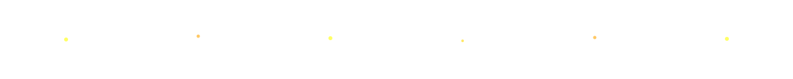

  
  &#8287;&#8287;&#8287;&#8287;&#8287;
  
  &#8287;&#8287;&#8287;&#8287;&#8287;
  
  &#8287;&#8287;&#8287;&#8287;&#8287;
  
  &#8287;&#8287;&#8287;&#8287;&#8287;
  
  &#8287;&#8287;&#8287;&#8287;&#8287;
  

  

  

  
  

 

# 💻 Tech Stack:

  <!-- React -->
  

  <!-- TypeScript -->
  

  <!-- Node.js -->
  

  <!-- AWS -->
  

  <!-- Docker -->
  

  <!-- Kubernetes -->
  

  <!-- Python -->
  

# 📊 GitHub Stats:
 
 

## 🏆 GitHub Trophies

### ✍️ Random Dev Quote

### 🔝 BOOT.DEV

  

